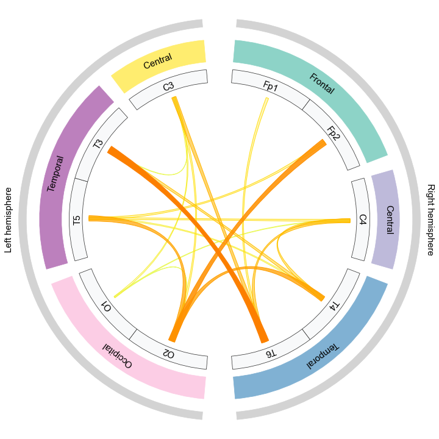
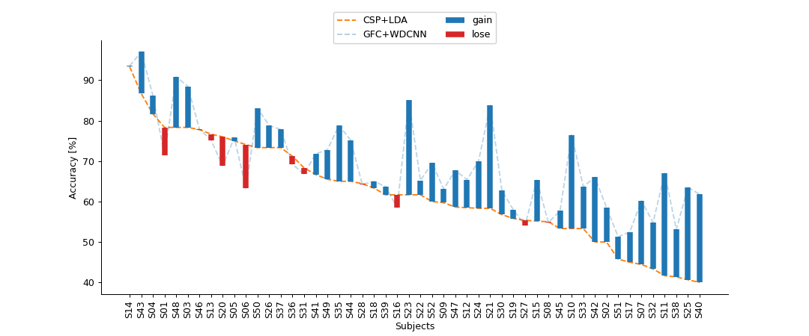
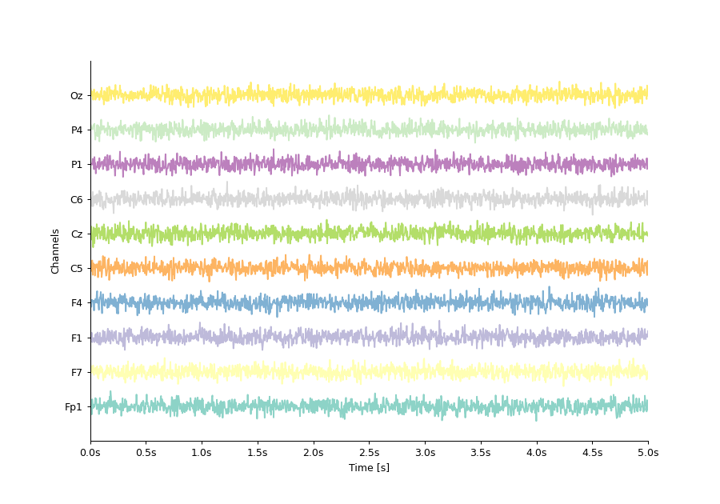

GCPDS - visualizations
======================

Installation
------------

.. code:: ipython3

    pip install -U git+https://github.com/UN-GCPDS/python-gcpds.visualizations.git

.. container:: gcpds-images0

   |Brain connectivities|

   |Accuracy and Gain Comparison (AGCO)|

   |EEG|

